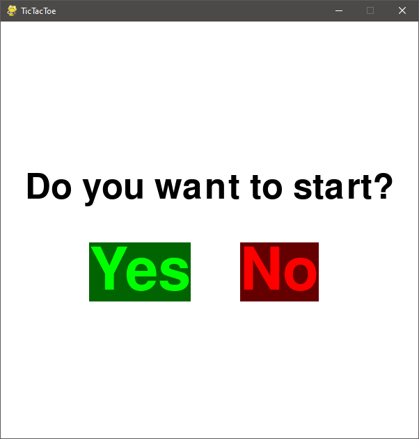
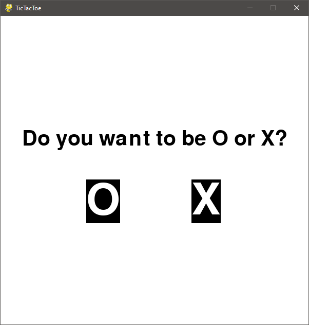
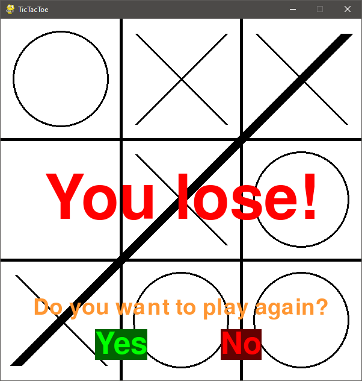
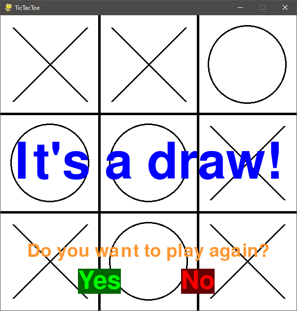

# TicTacToe
Playable TicTacToe game with user input and minimax computer algorithm that always wins or at least draws the game. 

## Setup

1. Run command: `pip install -r requirements.txt`
2. Run program at *src* with command: `TicTacToe.py`

## Screenshots

## Skills used
- splitting the project into multiple Classes
- implementing the minimax algorithm
- providing a simple GUI

### Possible improvements
- host the game to play online
- add the ability to play vs another player instead of the computer
