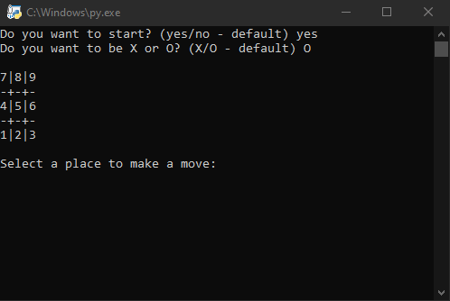
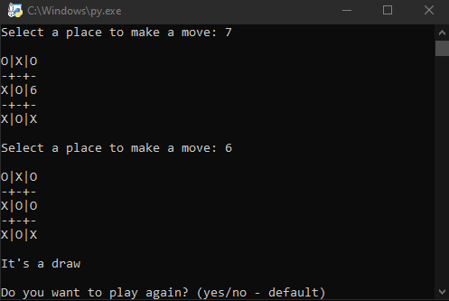

# TicTacToe
Playable TicTacToe game with user input and minimax computer algorithm that always wins or at least draws the game. 

# Screenshots

# Skills used
- splitting the project into multiple Classes
- implementing the minimax algorithm

# Possible improvements
- divide the Class methods and attributes better
- prepare a simple GUI
- host the game to play online
- add the ability to play vs another player instead of the computer
